# 无人值守共享空间共享茶室自助棋牌室源码
## 源代码小复杂，目前只提供给购买了相应硬件的用户，在硬件云有硬件设备用户可以下载源码 https://wdev.wmj.com.cn/

### 一、摘要
本系统适用于无人值守场景（茶室、棋牌室、运动场馆），主要功能流程为:顾客小程序下单预约—-自助开门—-开电—-云喇叭语音提醒。系统还考虑了加盟和商城，小复杂，其代码分为5个端：
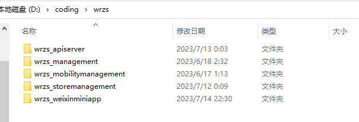
四个端需要部署在服务器，如：
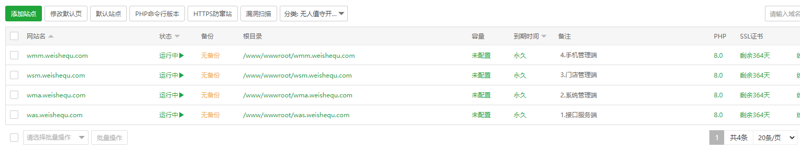
系统使用了Supervisor对房间和订单自动化管理
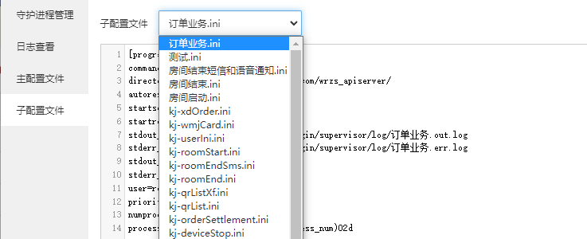

### 二、系统结构
1.接口服务端,部署案例：https://was.weishequ.com ;无UI界面。
2.系统管理端,部署案例：https://wma.weishequ.com
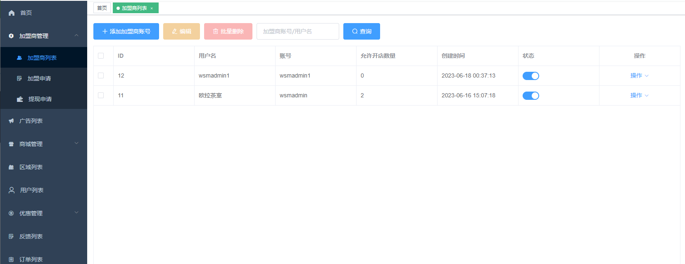
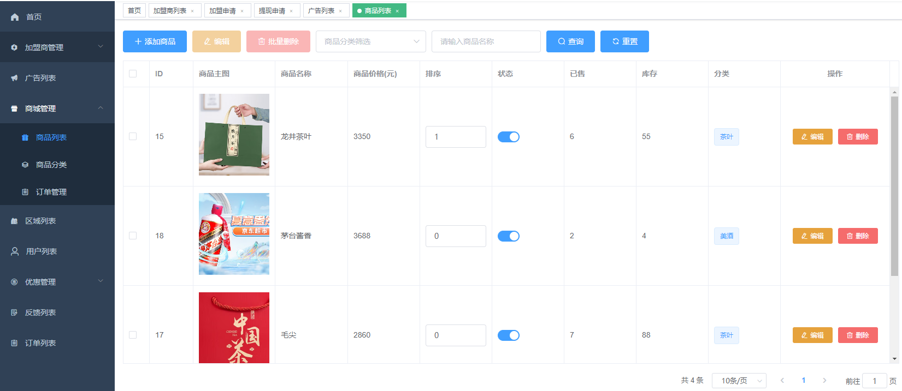

3.门店管理端,部署案例：https://wsm.weishequ.com （点击图片放大查看）
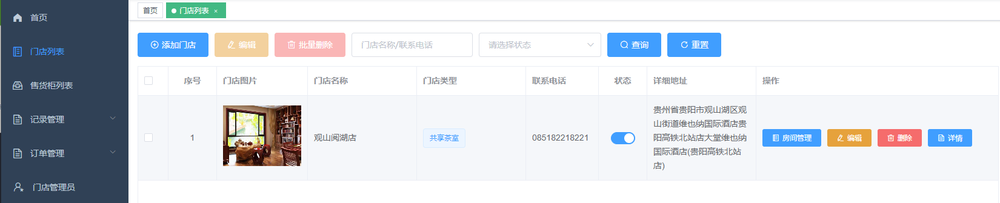
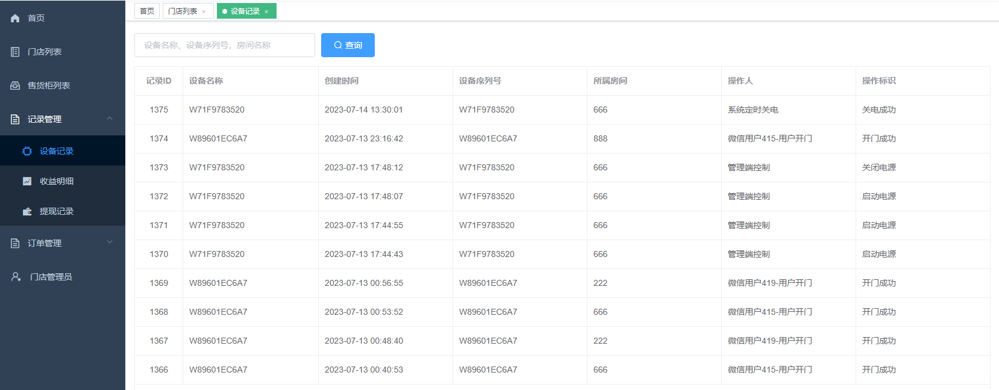
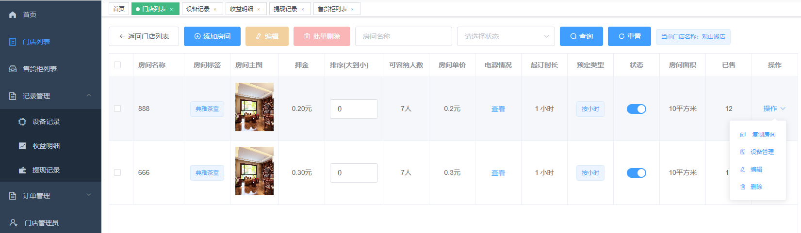
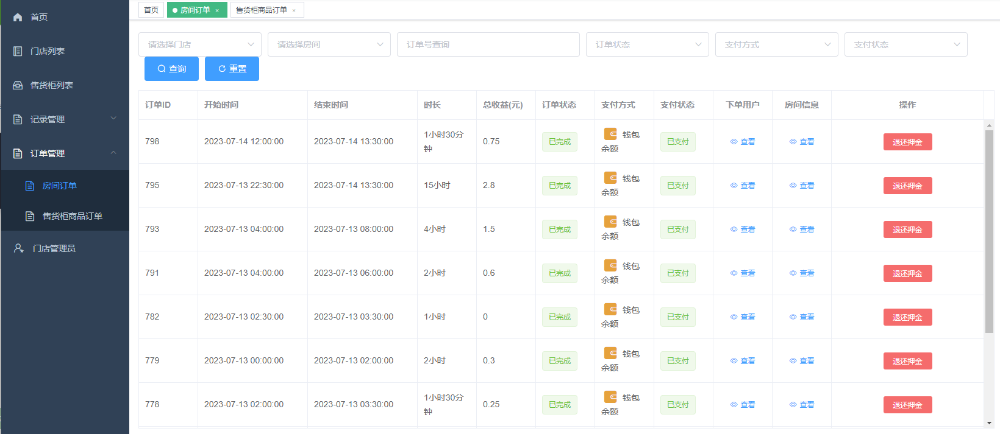

4.手机管理端,部署案例：https://wmm.weishequ.com

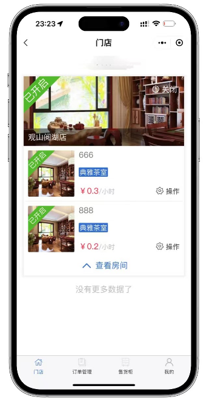
5.小程序端,部署案例：智云共享 小程序，扫码体验

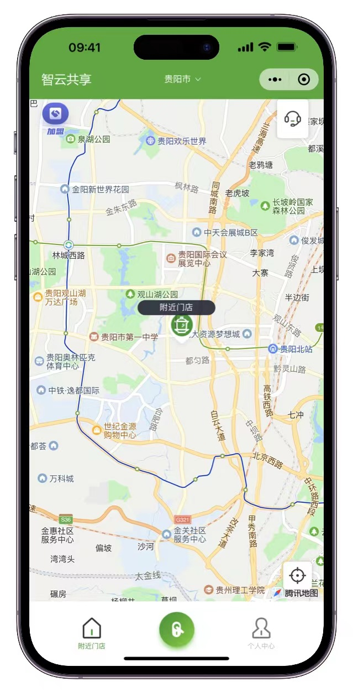
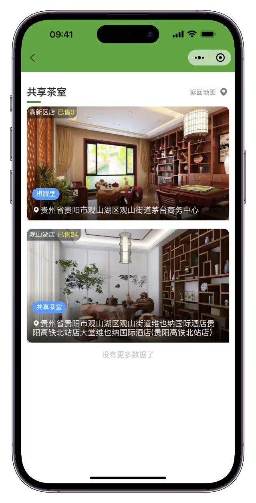
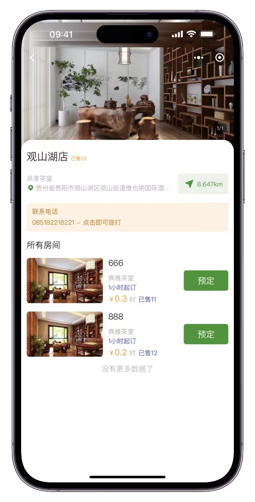
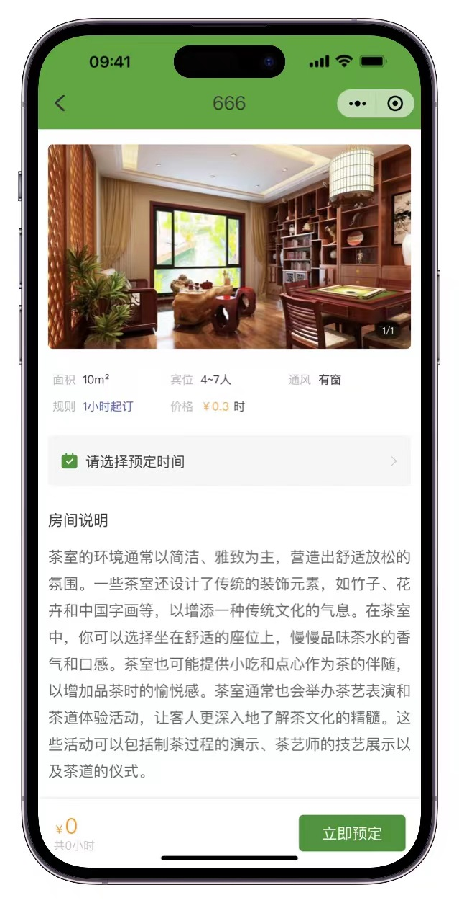
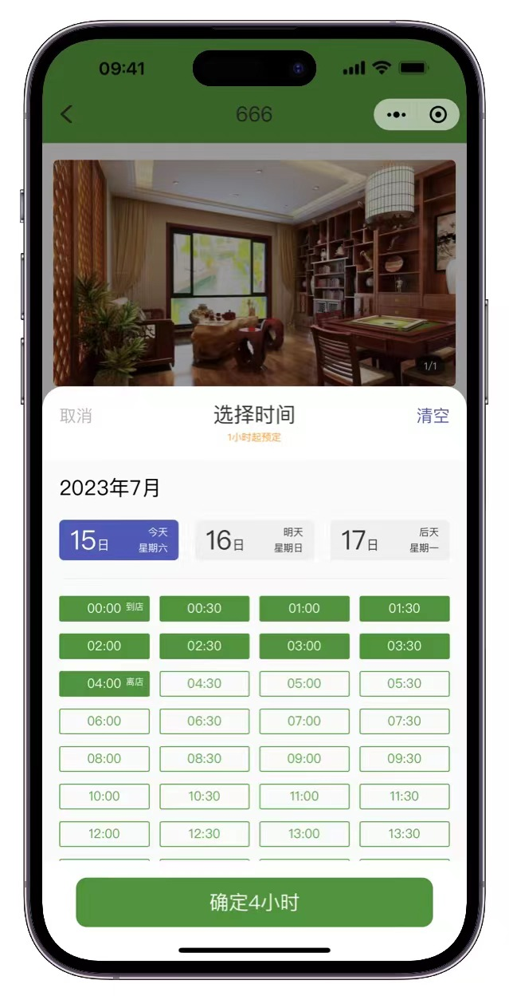

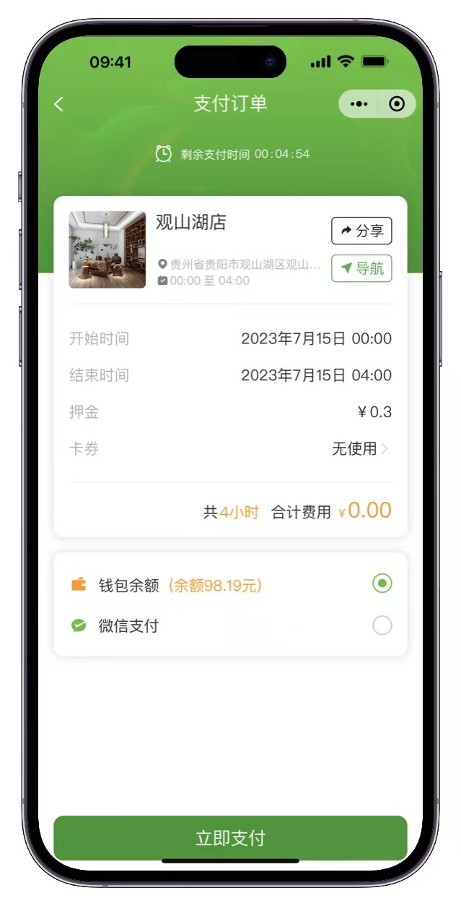
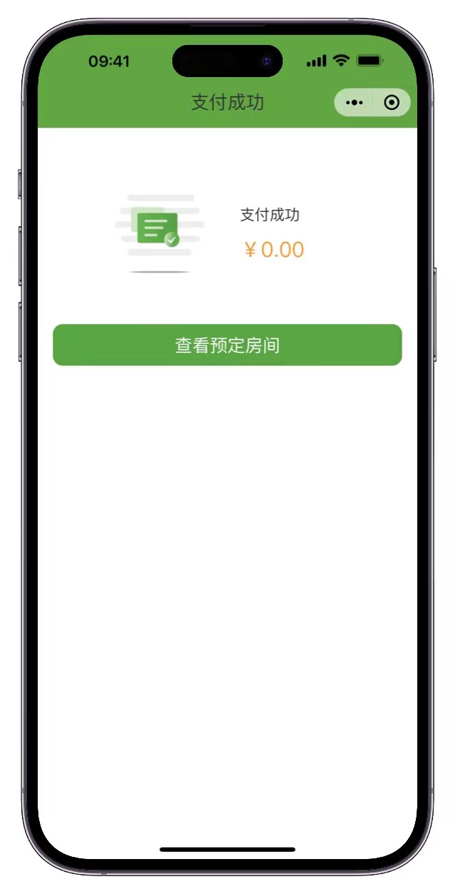
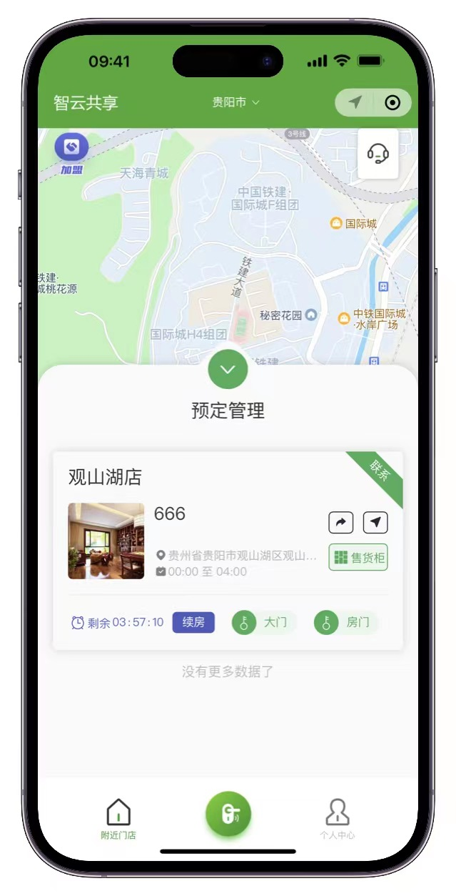
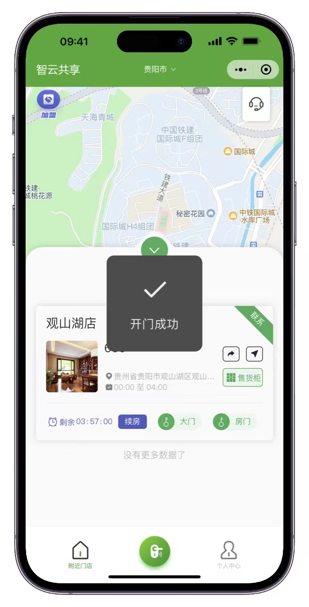
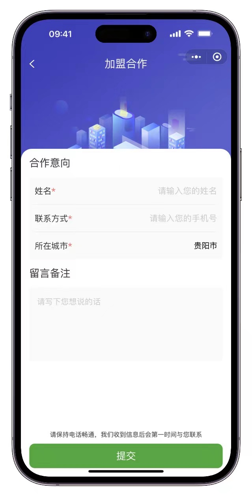
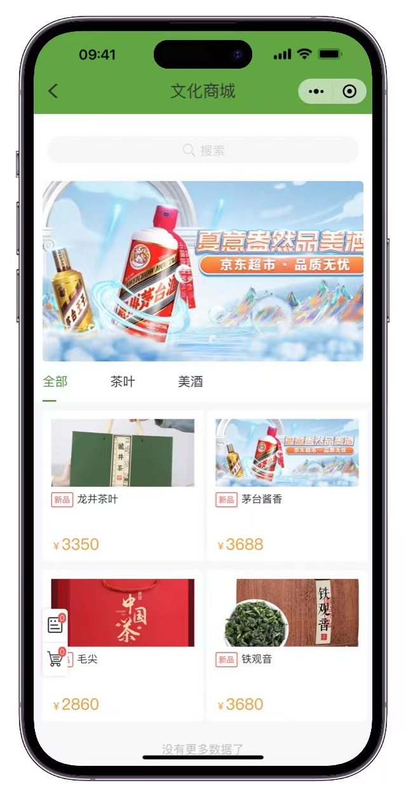
### 三、源代码过于复杂，请关注 https://wdev.wmj.com.cn