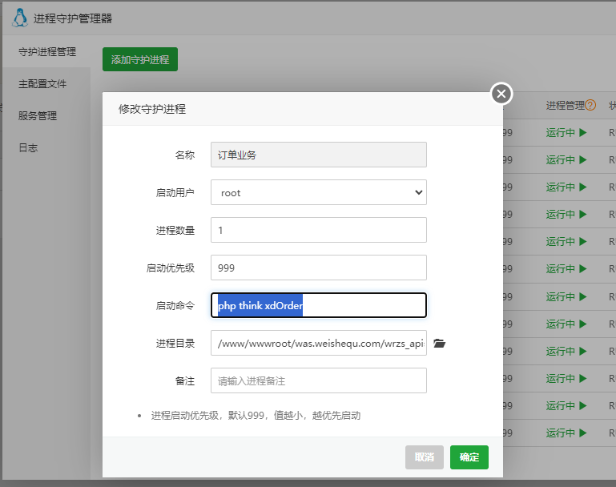

# 无人值守共享空间共享茶室自助棋牌室源码，前后端及数据库完整开源
### 源代码小复杂，需要熟悉Thinkphp、Vue、HBuilderX、SuperVisord、Pheanstalk等才能搞定，硬件购买地址 https://weimenjin.taobao.com （门禁机、低功耗实时连接wifi锁、空开断路器、云喇叭等,搭建后可以联系我们获取测试硬件序列号）。
### 下载请给个star，star是攻城狮生发的动力，本套代码是两个工程师半年多的成果，人工成本就在10万以上，感谢您的Star,扫码看演示小程序。


### 自建硬件云端说明及教程地址：https://doc.wmj.com.cn/1/page/192
### 一、摘要
本系统适用于无人值守场景（茶室、棋牌室、运动场馆），主要功能流程为:顾客小程序下单预约—-自助开门—-开电—-云喇叭语音提醒。系统还考虑了加盟和商城，小复杂，其代码分为5个端：

### 二、四个端需要部署在服务器，如：

### 三、系统使用了进程守护管理器（Supervisor）对房间和订单自动化管理，使用方法如下：
#### 1.宝塔面板安装进程守护管理器

#### 2.添加订单业务进程,启动指令 php think xdOrder，进程目录/www/wwwroot/was.weishequ.com/wrzs_apiserver/,如下图：

#### 3.添加房间启动进程，启动指令php think roomStart，目录同上，如下图：

#### 4.添加房间结束进程，启动指令php think roomEnd，目录同上，如下图：

#### 5.短信和语音通知进程，启动指令 php think roomEndSms，目录同上，如下图：


### 四、已部署好的演示平台（后端及小程序）
#### 1.接口服务端,部署案例：https://was.weishequ.com ;无UI界面。
小程序及收款商户配置文件在：wrzs_apiserver\app\common\kg\src\watch\Watch.php;

#### 2.系统管理端,部署案例：https://wma.weishequ.com 用户名admin 密码weimenjin 微门禁拼音，请不要修改这个密码，以便其他人能登录。


#### 3.门店管理端,部署案例：https://wsm.weishequ.com 用户名wsmadmin 密码wsmadmin（点击图片放大查看）


#### 4.手机管理端,部署案例：https://wmm.weishequ.com 帐号密码在门店管理端添加


#### 5.小程序端,部署案例：智云共享 小程序，扫码体验


### 五、 硬件云平台地址 https://wdev.wmj.com.cn/ ，手机号登录后获取API文档
### 六、数据库sql在目录下，配置文件为目录下.env文件

```php 
APP_DEBUG = true
[APP]
DEFAULT_TIMEZONE = Asia/Shanghai
[DATABASE]
TYPE = mysql
HOSTNAME =127.0.0.1
DATABASE = wrzs
USERNAME = wrzs
PASSWORD = 1111111111111111
HOSTPORT = 3306
CHARSET = utf8mb4
DEBUG = true
prefix = kg_
[LANG]
default_lang = zh-cn
```
### 七、硬件配置及购买链接

app\module\hardwareCloud\serverConfig.php
#### 默认对接硬件云配置
##### AppId 208ac48ff968ab0dc675008d0ded46d1
##### AppSecret ad45d97d283c518e15b4bda75c887dec

#### 测试设备
##### 1.不锈钢wifi门锁     W89601EC6A7
##### 2.WiFi版门禁控制器   W761790BC7F
##### 3.空开断路器 W71F9783520
##### 4.云喇叭 W7022621597


#### 适配硬件购买链接
##### 1.不锈钢wifi门锁（W89） https://item.taobao.com/item.htm?id=707688264083

##### 2.WiFi版门禁控制器（W76）  https://item.taobao.com/item.htm?id=620408378542

##### 3.空开断路器（W71） https://item.taobao.com/item.htm?id=717243906521

##### 4.云喇叭（W70） https://item.taobao.com/item.htm?id=719589244787
